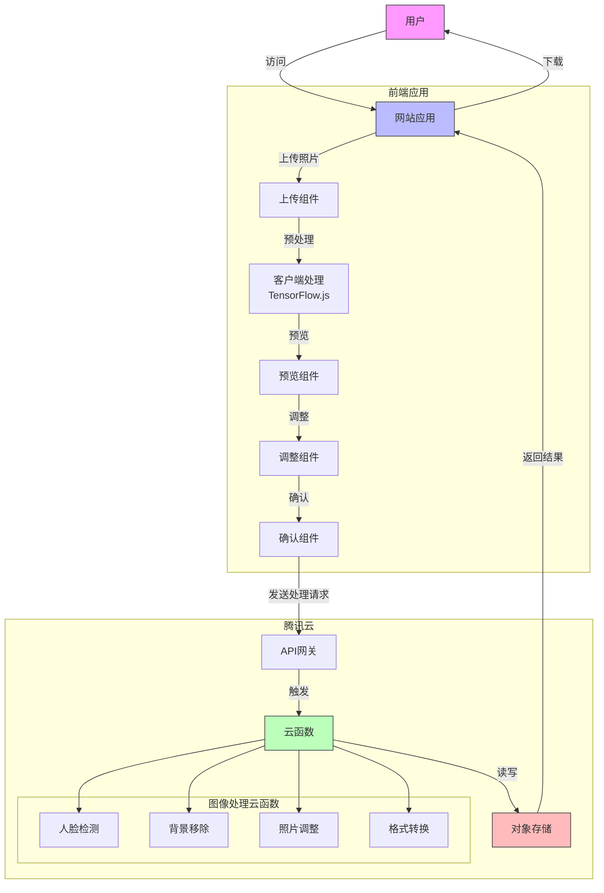
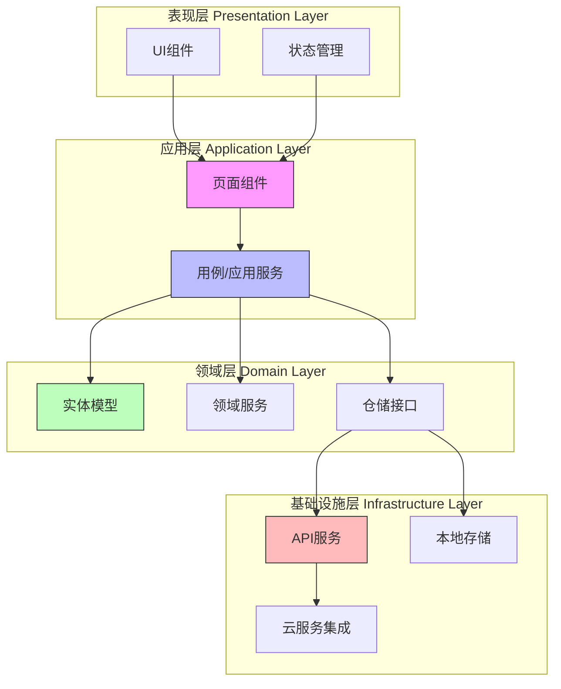
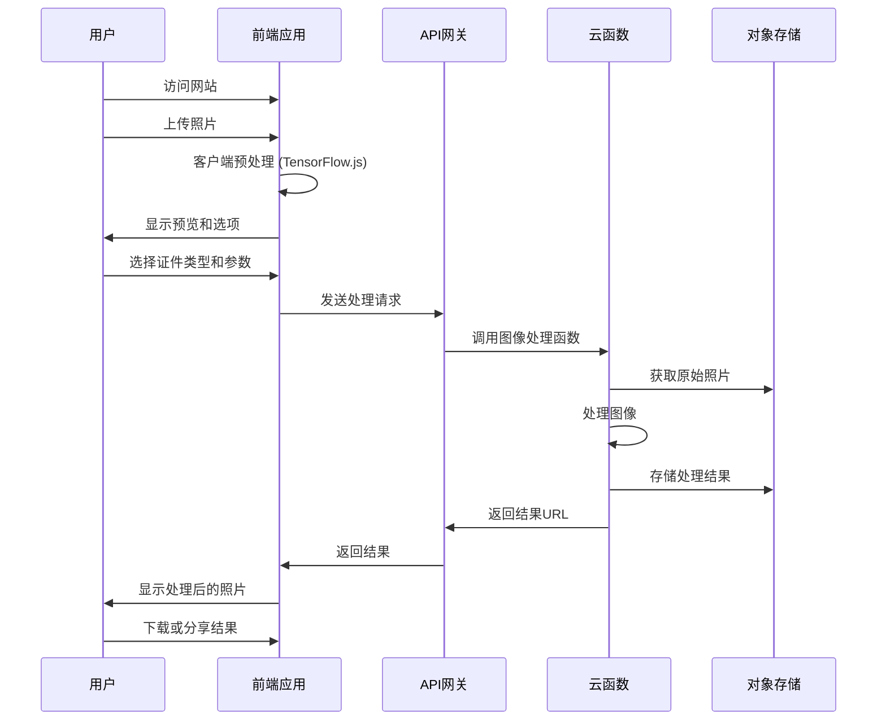

# 快证先生 (SnapCred) 系统架构文档

## 状态: 已批准

## 技术概述

快证先生是一个基于网络的照片处理平台，采用现代化前端技术和无服务器后端架构。本架构实现了高性能、可扩展的照片处理系统，确保用户能够快速且便捷地创建专业级证件照。系统采用领域驱动设计(DDD)模式构建前端应用，利用腾讯云无服务器云函数处理后端图像处理任务，从而实现弹性扩展和高可用性。

## 技术选型表

| 技术                         | 描述                                                   |
| ---------------------------- | ------------------------------------------------------ |
| React                        | 前端用户界面库，用于构建组件化、可复用的 UI            |
| Webpack                      | 前端资源打包和构建工具                                 |
| TypeScript                   | 静态类型检查的 JavaScript 超集，提高代码质量和可维护性 |
| Material UI / Ant Design     | UI 组件库，用于构建美观、一致的用户界面                |
| Redux Toolkit                | 状态管理库，用于管理全局应用状态                       |
| React Router                 | 前端路由管理                                           |
| Jest + React Testing Library | 前端测试框架                                           |
| TensorFlow.js                | 客户端机器学习库，用于人脸检测和初步图像处理           |
| Sharp.js                     | 高性能 Node.js 图像处理库                              |
| 腾讯云函数 (SCF)             | 无服务器计算服务，用于后端图像处理                     |
| 腾讯云对象存储 (COS)         | 云存储服务，用于存储用户上传的照片和处理结果           |
| 腾讯云 API 网关              | 管理 API 请求，提供认证、限流等功能                    |
| GitHub Actions               | CI/CD 自动化部署管道                                   |

## 架构图

### 系统总体架构



### 前端架构 (DDD)



### 用户流程图



## 数据模型

### 照片处理请求

```json
{
  "requestId": "string",
  "userId": "string (可选)",
  "sourceImageUrl": "string",
  "credentialType": {
    "type": "string",
    "country": "string",
    "format": "string"
  },
  "processingOptions": {
    "backgroundColor": "string (hex)",
    "brightness": "number",
    "contrast": "number",
    "cropParameters": {
      "x": "number",
      "y": "number",
      "width": "number",
      "height": "number"
    },
    "enhanceFace": "boolean",
    "removeBackground": "boolean"
  },
  "outputOptions": {
    "format": "string (jpg/png)",
    "quality": "number",
    "dimensions": {
      "width": "number",
      "height": "number"
    }
  },
  "timestamp": "datetime"
}
```

### 证件照规格

```json
{
  "credentialTypeId": "string",
  "name": {
    "zh": "string",
    "en": "string"
  },
  "country": "string",
  "dimensions": {
    "width": "number (mm)",
    "height": "number (mm)"
  },
  "pixelDimensions": {
    "width": "number (px)",
    "height": "number (px)",
    "dpi": "number"
  },
  "backgroundColor": "string (hex)",
  "requirements": {
    "faceHeight": "percentage",
    "eyePosition": "percentage from top",
    "additionalRules": ["string"]
  },
  "preview": "string (image url)"
}
```

## 项目结构

```
/
├── /public                 # 静态资源
│   ├── /locales           # 国际化翻译文件
│   └── /images            # 静态图片资源
├── /src
│   ├── /app               # 应用核心
│   │   ├── /pages         # 页面组件
│   │   └── /hooks         # 全局钩子函数
│   ├── /domain            # 领域层
│   │   ├── /entities      # 领域实体
│   │   ├── /services      # 领域服务
│   │   └── /repositories  # 仓储接口
│   ├── /infrastructure    # 基础设施层
│   │   ├── /api           # API服务
│   │   ├── /storage       # 本地存储服务
│   │   └── /config        # 配置文件
│   ├── /presentation      # 表现层
│   │   ├── /components    # UI组件
│   │   │   ├── /common    # 通用组件
│   │   │   ├── /layout    # 布局组件
│   │   │   └── /photos    # 照片处理组件
│   │   ├── /hooks         # UI钩子函数
│   │   └── /store         # 状态管理
│   └── /utils             # 工具函数
├── /server                # 本地开发服务器
├── /cloud                 # 云函数代码
│   ├── /functions         # 各功能云函数
│   ├── /common            # 共享模块
│   └── /test              # 测试代码
├── /tests                 # 测试文件
│   ├── /unit              # 单元测试
│   ├── /integration       # 集成测试
│   └── /e2e               # 端到端测试
└── /config                # 配置文件
    ├── webpack.config.js  # Webpack配置
    └── jest.config.js     # Jest测试配置
```

## 变更日志

| 变更     | 故事 ID | 描述               |
| -------- | ------- | ------------------ |
| 初始架构 | N/A     | 初始系统设计和文档 |
