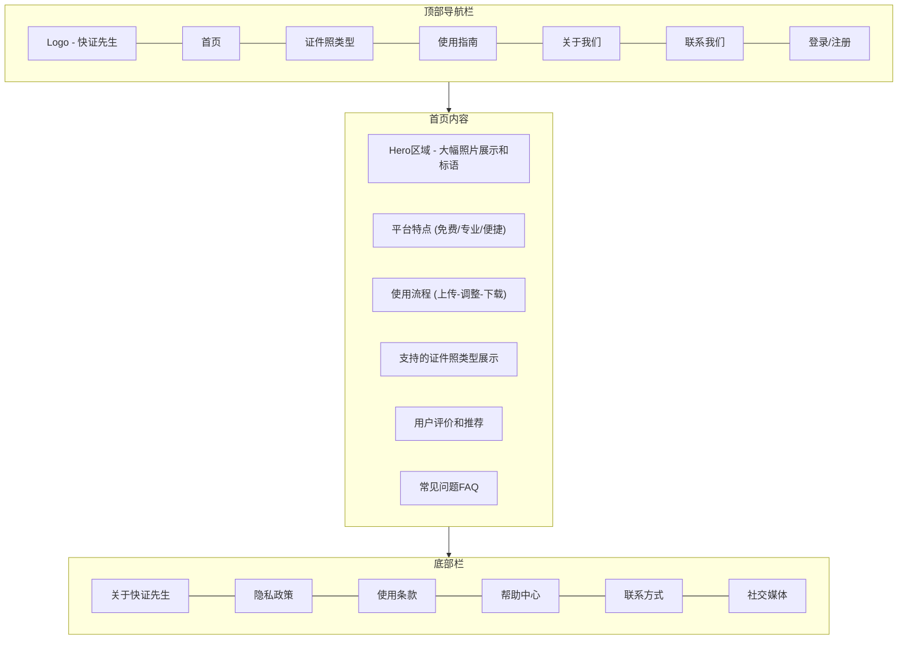
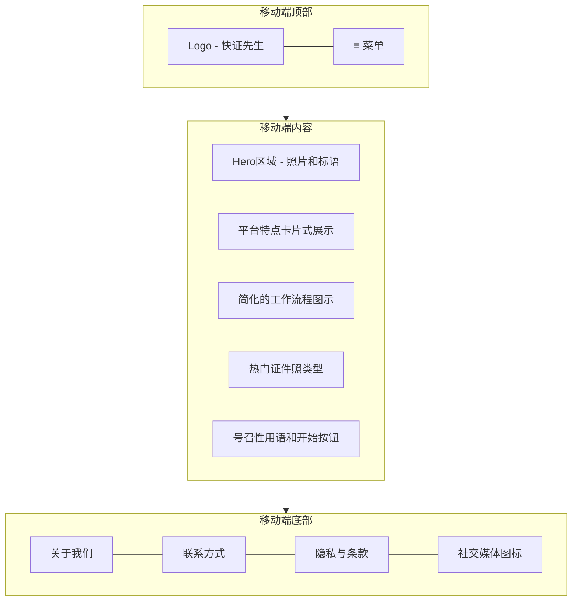
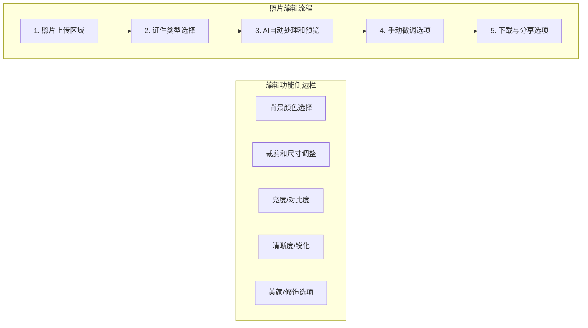

# 产品需求文档 (PRD) - 快证先生 (SnapCred)

## 状态: 已批准

## 简介

快证先生 (SnapCred) 是一个基于网络的照片处理平台，旨在帮助用户无需前往照相馆即可创建专业证件照。该平台允许用户上传自己的照片，并将其转换为各种类型的证件照，包括护照照片、驾驶证照片、签证照片等。快证先生的目标是提供一个免费、高质量的传统照相馆替代方案，使获取证件照的过程对每个人来说都更加便捷、方便和经济实惠。

## 目标

- 提供一个用户友好的平台，可从个人照片创建专业证件照
- 支持来自不同国家和机构的各种证件照类型和规格
- 提供与专业照相馆相媲美的高质量成果
- 对所有用户免费提供服务
- 创建在桌面和移动设备上无缝运行的响应式网络应用
- 在上线后的前六个月内实现 10 万月活跃用户
- 基于用户反馈达到 4.5 星以上的用户满意度评分

## 原型草图

### 桌面端网站原型

### 移动端布局原型

### 照片编辑页原型

## 功能与需求

### 功能需求

#### 核心照片处理

- 支持常见图像格式（JPG、PNG、HEIF 等）的照片上传功能
- 自动检测上传照片中的人脸
- 背景移除和替换工具（纯色背景、标准背景）
- 照片调整工具（裁剪、旋转、尺寸调整）
- 自动调整大小以满足特定证件要求
- 面部特征增强（光线、阴影、肤色）
- 符合官方规格的专业质量照片输出

#### 证件类型支持

- 护照照片（国际标准）
- 签证申请照片（按国家定制）
- 身份证照片（国民身份证）
- 驾驶证照片
- 工作许可证照片
- 移民照片
- 结婚证照片
- 工作证照片
- 学生证照片
- 专业认证照片

#### 用户体验

- 照片创建的分步引导流程
- 最终处理前的预览功能
- 处理后照片的即时下载
- 不同分辨率和格式的选项
- 单次会话中的多照片处理
- 为回访用户提供照片存储（需要账户）
- 分享选项（电子邮件、社交媒体、直接链接）

#### 平台支持

- 适用于桌面浏览器的响应式设计
- 优化的移动端体验（H5）
- 照片编辑的触摸屏优化
- 跨浏览器兼容性

### 非功能需求

- **性能**：照片处理在 5 秒内完成
- **可扩展性**：支持多达 10,000 名并发用户
- **可靠性**：网络应用 99.9%的运行时间
- **安全性**：安全处理用户照片和数据
- **易用性**：直观的界面，无需培训
- **无障碍**：符合 WCAG 2.1 AA 标准
- **国际化**：支持中文和英文界面

## 史诗结构

史诗-1：核心平台开发（当前）
史诗-2：高级照片处理功能（未来）
史诗-3：用户账户管理与照片存储（未来）
史诗-4：企业与批量处理功能（未来）

## 故事列表

### 史诗-1：核心平台开发

故事-1：设计并实现响应式网站布局
故事-2：创建照片上传和基本处理功能
故事-3：实现面部检测和背景移除
故事-4：开发证件照规格数据库
故事-5：构建照片调整工具（裁剪、调整大小、旋转）
故事-6：实现处理后照片的下载功能
故事-7：创建选择证件照类型的用户界面
故事-8：开发初始移动端响应式设计

## 技术栈

### 前端

- 框架：React
- 构建工具：Webpack
- 架构：领域驱动设计 (DDD)
- 状态管理：Redux/Context API
- UI 组件：基于 Material UI/Ant Design 的自定义组件
- 测试：Jest, React Testing Library

### 后端

- 无服务器：腾讯云函数
- 图像处理：Sharp.js, TensorFlow.js
- 存储：腾讯云对象存储 (COS)
- API：RESTful APIs, GraphQL

### DevOps

- CI/CD：GitHub Actions
- 监控：腾讯云监控
- 日志：ELK Stack 或云原生解决方案

## 未来增强功能

- AI 驱动的照片增强功能
- 多照片批量处理
- 具有高级功能的付费订阅模式
- 专业打印和递送选项
- 与社交媒体平台集成
- 移动原生应用（iOS/Android）
- 第三方集成的 API 访问
- 需要批量证件照的企业/组织解决方案
- 实体照片递送服务
- 证件更新的定期照片提醒
