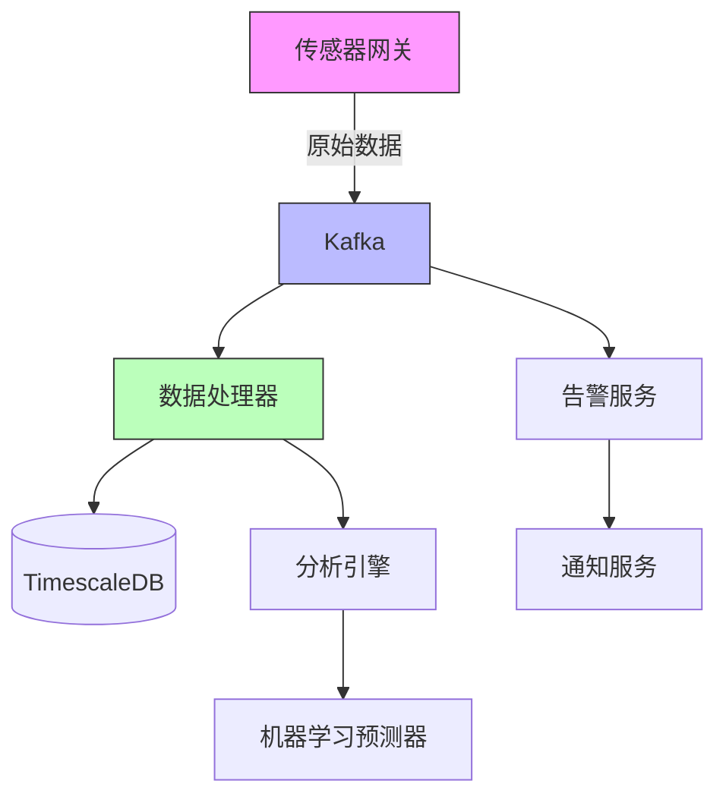
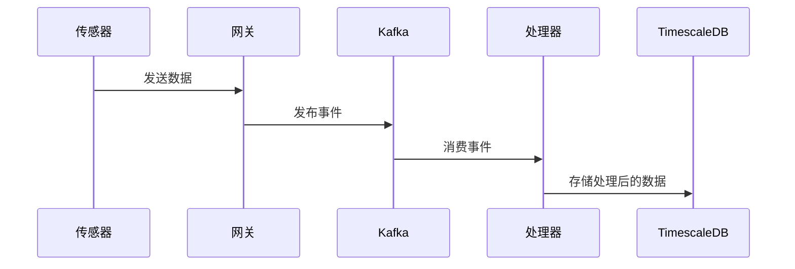

# 架构模板

<version>1.0.0</version>

## 要求

- 清晰记录架构决策
- 维护变更日志
- 明智地使用 mermaid 图表

## 结构

### 必需部分

#### 1. 标题 {架构用于 {项目}}

#### 2. 状态

- 草稿
- 已批准

#### 3. 技术摘要

#### 4. 技术表

列出语言、库、基础设施等选择的表格...

- 技术列
- 描述列

#### 5. 架构图

- 根据需要使用 Mermaid 图表

#### 6. 数据模型、API 规范、模式等...

- 不需要详尽 - 但需要保留和跨故事遵循的关键思想

#### 7. 项目结构

记录文件夹和文件组织结构以及描述

#### 8. 变更日志

文档不再处于草稿状态并更新后的关键变更的 markdown 表格，表格包括变更标题、变更发生的故事 ID 以及如果标题不够清晰的描述

## 示例

<example>
# 传感器数据处理平台架构

## 状态：已批准

## 技术摘要

该架构定义了一个可扩展、容错的平台，用于处理来自多个来源的实时传感器数据。系统采用微服务架构，确保高可用性、可扩展性和可维护性，同时支持实时数据处理和分析。

## 技术表

| 技术         | 描述                               |
| ------------ | ---------------------------------- |
| Kubernetes   | 用于微服务部署的容器编排平台       |
| Apache Kafka | 用于实时数据摄取的事件流平台       |
| TimescaleDB  | 用于传感器数据存储的时间序列数据库 |
| Go           | 数据处理服务的主要语言             |
| GoRilla Mux  | REST API 框架                      |
| Python       | 用于数据分析和机器学习服务         |
| gRPC         | 服务间通信协议                     |
| Prometheus   | 指标收集和监控                     |
| Grafana      | 可视化和仪表板                     |

## 架构图





## 数据模型

### 传感器读数模式

```json
{
  "sensor_id": "string",
  "timestamp": "datetime",
  "readings": {
    "temperature": "float",
    "pressure": "float",
    "humidity": "float"
  },
  "metadata": {
    "location": "string",
    "calibration_date": "datetime"
  }
}
```

## 项目结构

```
/
├── /services
│   ├── /gateway        # 传感器数据摄取
│   ├── /processor      # 数据处理和验证
│   ├── /analytics      # 数据分析和机器学习
│   └── /notifier       # 告警和通知系统
├── /deploy
│   ├── /kubernetes     # K8s 配置清单
│   └── /terraform      # 基础设施即代码
└── /docs
    ├── /api           # API 文档
    └── /schemas       # 数据模式
```

## 变更日志

| 变更             | 故事 ID | 描述                                     |
| ---------------- | ------- | ---------------------------------------- |
| 初始架构         | N/A     | 初始批准的系统设计和文档                 |
| 添加机器学习管道 | story-4 | 机器学习预测服务的集成                   |
| Kafka 升级       | story-6 | 从 Kafka 2.0 升级到 Kafka 3.0 以提高性能 |

</example>

<example type="invalid">
# 简单架构

只使用数据库和一些 API。如果需要，可能稍后添加缓存。

技术栈：

- 最简单的方式
- 可能是 MongoDB
- 某些框架

没有包含图表或适当的文档。
</example>
